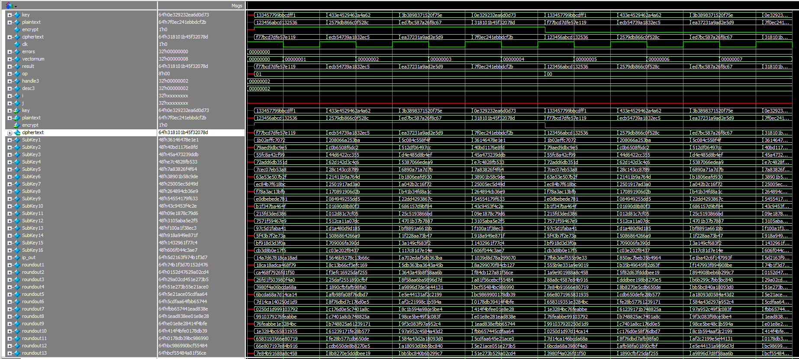
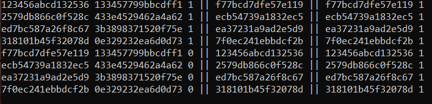

## 64 bit Data Encryption Standard written in SystemVerilog
'''
Soren Petersen &
Kyle Bowser
'''
This was a lab for our digital logic design class at OSU. We were given a stub file and some basic context for Data Encryption Standard. 


### Major Code Blocks

The feistel is one of the major operative blocks. Most of the rest are shifts or the runner module.

```markdown
module feistel (inp_block, subkey, out_block);

   input logic [31:0]  inp_block;
   input logic [47:0]  subkey;
   output logic [31:0] out_block;

   logic [31:0] sout;
   logic [47:0] exp_out;
   logic [47:0] int_block1;

   EF ef(inp_block, exp_out);

   assign int_block1 = exp_out ^ subkey;

   S1_Box s1(int_block1[47:42], sout[31:28]);
   S2_Box s2(int_block1[41:36], sout[27:24]);
   S3_Box s3(int_block1[35:30], sout[23:20]);
   S4_Box s4(int_block1[29:24], sout[19:16]);
   S5_Box s5(int_block1[23:18], sout[15:12]);
   S6_Box s6(int_block1[17:12], sout[11:8]);
   S7_Box s7(int_block1[11:6], sout[7:4]);
   S8_Box s8(int_block1[5:0], sout[3:0]);
   SF sf(sout, out_block);

endmodule // Feistel
```

There is also the round module which has similar importance and in the main runner code is called the most. 

```markdown
module round (inp_block, subkey, out_block);

    input logic [63:0] inp_block;
	input logic [47:0] subkey;
	output logic [63:0] out_block;

	logic [31:0] lb1, rb1, rb2;


	assign lb1 = inp_block[63:32];
	assign rb1 = inp_block[31:0];
	

	logic [31:0] lb2;
	assign lb2 = rb1[31:0];

	logic [31:0] permutefeistel;
	feistel f(rb1, subkey, permutefeistel);

	assign rb2 = lb1 ^ permutefeistel;

	assign out_block = {lb2[31:0], rb2[31:0]};

endmodule // round1
```

### Waveform

### Des.out file

